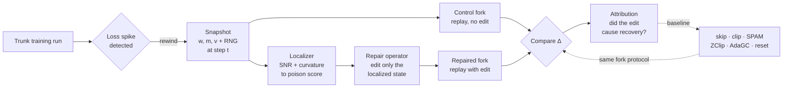
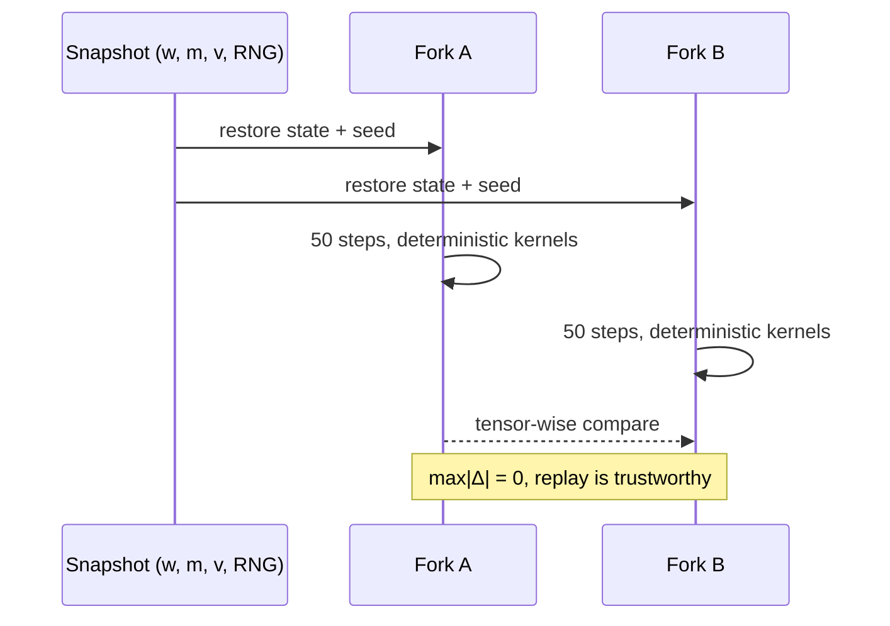
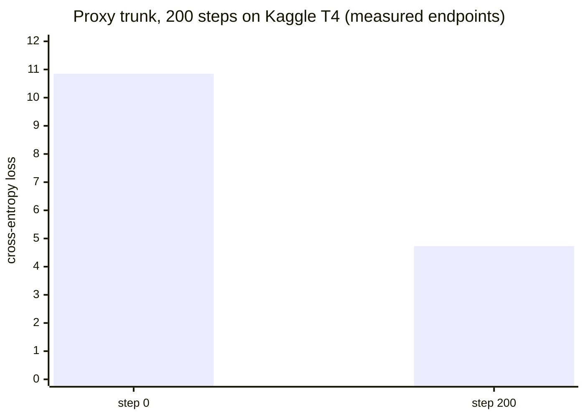

<div align="center">

# Optimizer Autopsy

**Rewind the run. Localize the poison. Repair the state. Prove it.**

Causal localization and repair of optimizer state at the moment a training run's loss spikes, with bit-identical replay as the standard of proof. The instrument was built and GPU-verified on free Kaggle CUDA; the project is now restarting on a dedicated AMD MI300X budget under [PLAN&nbsp;V6](PLAN_V6.md).

[](https://github.com/jaztulsi/optimizer-autopsy/actions/workflows/ci.yml)
[](LICENSE)
[](research/requirements.txt)
[](#compute)
[](#the-determinism-gate)

[Website](https://jaztulsi.github.io/optimizer-autopsy/) ·
[Problem](#the-problem) ·
[Method](#how-it-works) ·
[Determinism gate](#the-determinism-gate) ·
[Results](#results) ·
[Plan](#plan-and-budget) ·
[Layout](#repository-layout) ·
[Install](#installation) ·
[Quick start](#quick-start) ·
[Status](#status)

</div>

---

Optimizer Autopsy treats a training-loss spike like a crime scene. When a large model's loss suddenly jumps, today's remedies are blunt: clip the gradient, skip the batch, or roll back and hope. None of them answer the question that matters: *which part of the optimizer state actually got poisoned, and would repairing only that part recover the run?* This project answers it, and holds every answer to a hard evidentiary bar: a repaired run must be compared against a **byte-for-byte identical replay**, so the measured recovery is attributable to the repair and nothing else.

## The problem

A spike damages the optimizer's internal state: the Adam moments `(m, v)` and the weights `w`, in ways that persist for thousands of steps. The standard interventions operate globally and blindly. Optimizer Autopsy instead:

1. **Rewinds** training to the exact step the spike began, from a saved snapshot.
2. **Localizes** the damage by scoring every parameter's optimizer state with a signal-to-noise and curvature instrument, producing a *poison score*.
3. **Repairs** only the localized state, then **forks** the run to compare the repaired trajectory against an unedited replay, isolating the causal effect of the edit.

## How it works



Every intervention (ours and each baseline) is applied as a fork off the *same* snapshot, so the only difference between two trajectories is the edit under test.

## The determinism gate

The whole method rests on one property: replaying training from a snapshot must produce identical numbers, or a fork's Δ would be measuring nondeterminism instead of the intervention. This gate is built and verified on both CPU and a real Kaggle T4 (CUDA). It is **being re-earned, not assumed, on AMD**: the ROCm math libraries are a different implementation with no exact `CUBLAS_WORKSPACE_CONFIG` analog, so PLAN V6 runs a cheap go/no-go smoke test on MI300X before spending the full determinism budget.



On CUDA, `CUBLAS_WORKSPACE_CONFIG=:4096:8` is exported before torch is imported (the notebook launchers handle this); `research/harness/determinism.py` locks seeds and deterministic algorithms. The guarantee is enforced in CI on every push by `research/tests/test_determinism.py`. The ROCm equivalent of that setup routine is what PLAN V6's Phase 1 re-derives on AMD.

## Results

The proxy trunk (a small nanoGPT) trains on a free Kaggle T4. Its cross-entropy loss more than halved over 200 steps. The training loop learns, and the run is fully reproducible.



Verified facts to date (CUDA / Kaggle T4, committed under [`results/`](results/)): `bitwise replay OK on cuda: 50 steps, max|Δ| = 0`; `trunk done: 200 steps, loss 10.851 -> 4.730`; and the fork gate itself reads `max|Δ| = 0` (noop-vs-noop), which is what makes the instrument (C1) trustworthy. These are CUDA-era results; AMD re-verification is the first item in PLAN V6.

## Plan and budget

The project is restarting on **AMD MI300X** (a dedicated grant) instead of Kaggle's quota-limited free tier, which kept running out of hours. The **audited AMD compute ask is ~15–40 GPU-hours**, not the earlier "500–600" — a bottom-up recount (measured 0.0619 s/step at proxy scale + a full code audit of GPU-bound vs engineering-time work; see [`research/kaggle/step_timer_results.md`](research/kaggle/step_timer_results.md)) found that the old figure conflated **build-effort (person-hours)** with **GPU-compute**. The ~15–40h is ~5–10h to re-earn bit-exact determinism on AMD/ROCm (the one line nothing has tested — every measurement so far ran on NVIDIA/CUDA) plus ~3–30h of proxy-scale GPU-bound science. The full reference is [PLAN&nbsp;V6](PLAN_V6.md); the essentials:

- **Path B (port, don't rebuild).** The hardware-independent code (data pipeline, model, spike recipes, fork/branch design, and the already-verified determinism/snapshot/fork spine) carries over unchanged. Only the hardware-specific determinism guarantee is re-earned on ROCm.
- **Go/no-go first.** Before the full 30-hour AMD determinism line, a ~6-hour smoke test checks bit-for-bit reproducibility of the exact ops this pipeline uses (the HVP double-backward and the Adam moment update). If it can't hit exact zero, Phase 1 pivots to a tolerance-based statistical framework rather than discovering the wall weeks in.
- **A written cut order and three scope tiers** (Floor / Core / Stretch, measured in build-effort, not GPU-hours), so a smaller-or-larger scope doesn't force a rewrite. The GPU-compute ask (~15–40 GPU-h) is small at every tier; the [124M robustness check](research/kaggle/step_timer_results.md) (~71–302 GPU-h/battery) stays on free-tier Kaggle over multiple weeks, off the AMD ask.
- **Pre-registered decisions** for the two places a result could be nudged: the cheap-fix kill-test and the ψ_k repair-sufficiency threshold.
- **Timeline:** NeurIPS 2026 has passed; the honest targets are **TMLR** (no deadline, judges claim-support) and a NeurIPS 2027 cycle.

> Compute status is honest: the Exea Labs AMD grant is requested, not yet confirmed, and nothing in the budget is locked until it resolves. See [PLAN V6 §5, §11](PLAN_V6.md).

## Repository layout

```
optimizer-autopsy/
├── research/                 All project source (Python)
│   ├── harness/              Determinism, preflight, secrets, (w,m,v) snapshots, trunk + fork runners
│   ├── model/                nanoGPT: proxy (1-3M) and 124M
│   ├── data/                 Reproducible tokenize + shard of the corpus
│   ├── localizer/            The instrument: SNR + curvature to poison score
│   ├── repair/               The surgery: edit the localized optimizer state
│   ├── baselines/            skip · clip · SPAM · ZClip · AdaGC · naive-reset, each as a fork intervention
│   ├── spikes/               Induce spikes, tune the detector, build the K2 spike set
│   ├── analysis/             Eval · stats · attribution · figures
│   ├── theory/               Analytical backing for the localizer
│   ├── experiments/          proxy/ (free MVP) and llm124m/ (robustness) configs + drivers
│   ├── configs/              Shared config loading
│   ├── tests/                Determinism + secret-hygiene gates (run in CI)
│   └── requirements.txt      Pinned to the CUDA Kaggle image (ROCm/AMD pins land in V6 Phase 1)
├── results/                  Committed run evidence (per-task JSON + Kaggle logs)
├── notebooks/                Kaggle / Colab launchers (set env, clone, load secrets, expose run())
├── index.html                GitHub Pages site (research plan)
├── PLAN_V6.md                Governing plan: AMD restart, budget, go/no-go, cut order
├── BUILD_PLAN.md             Per-file 26-task science detail (V6 supersedes its hardware/DoD)
├── context-ai.md             Full technical context packet (state of record in §14)
├── EXPLANATION.md            Plain-English guide to the whole project
├── update.md                 Plain-English status
└── .github/workflows/ci.yml  CPU CI gate
```

Large generated artifacts (checkpoints, snapshots, shards, spike sets) stay outside git (see [Compute](#compute)).

## Requirements

- Python 3.11 (matches the Kaggle CUDA image; the AMD/ROCm pin set lands in PLAN V6 Phase 1)
- GPU: a [Kaggle](https://www.kaggle.com/) T4 built and verified everything so far; the restart targets an AMD MI300X grant
- Optional: [Hugging Face](https://huggingface.co/) (artifact storage) and [Weights & Biases](https://wandb.ai/) (logging) accounts (both free tier)

No local GPU is needed or used; all compute runs on cloud GPUs.

## Installation

```bash
git clone https://github.com/jaztulsi/optimizer-autopsy.git
cd optimizer-autopsy
pip install -r research/requirements.txt
```

## Quick start

The tests run anywhere (CPU, no secrets, no GPU):

```bash
pytest research/tests/         # determinism gate + secret-hygiene guard
```

Real runs go on a free GPU. Open a notebook launcher, [`notebooks/kaggle_runner.ipynb`](notebooks/kaggle_runner.ipynb) or [`notebooks/colab_runner.ipynb`](notebooks/colab_runner.ipynb), which sets the determinism env var, clones this repo, loads secrets, and exposes `run(...)`:

```python
run("python -m research.experiments.proxy.smoke")        # free MVP keep/kill signal
run("python -m research.experiments.llm124m.run trunk")  # 124M robustness (budgeted)
```

<a name="compute"></a>
## Compute

Code lives here; compute in the cloud; artifacts on the Hub. The instrument was built on free tiers, but Kaggle's 30 h/week quota kept running out mid-experiment, so the restart moves real runs to a dedicated AMD budget.

| Component | Service | Role |
| --- | --- | --- |
| Code | GitHub | This repository |
| Compute (target) | AMD MI300X via Exea Labs (audited ask ~15–40 GPU-h, requested) | The V6 restart: real experiments |
| Compute (origin) | Kaggle T4 (30 h/week, headless via the Kaggle CLI) | Where C1 was built + CUDA-verified |
| Compute (iteration) | Colab | Fast proxy-scale iteration |
| Compute (backup) | Azure credits (in reserve) | Overflow compute + checkpoint storage |
| Artifacts | Hugging Face Hub (`optimizer-autopsy-artifacts`) | Checkpoints, snapshots, shards, spike sets |
| Logging | Weights & Biases | Loss curves and run metadata |

### Secrets

Secrets are never committed. `research/harness/secrets.py` resolves them at runtime from, in order, the process environment, Kaggle Secrets, Colab userdata, then a gitignored `.env`. A CI test (`test_no_secrets_in_git`) fails the build if any token literal reaches the tracked tree. Required keys: `HF_TOKEN`, `WANDB_API_KEY`.

## Status

The instrument (C1) is complete and CUDA-verified; the actual science (localizer C2, repair C3) is entirely ahead. Everything shipped so far is tested, passing, and committed with run evidence under [`results/`](results/).

```
Foundation       ####################  done (scaffold, env, fixed data, secrets)
Instrument (C1)  ####################  done, CUDA-verified: snapshot + fork Δ==0 gate pass
Spike induction  ####################  2 recipes qualify under V6 policy; fresh GPU confirmation pending
Kill-test        ####----------------  battery built; not yet run to a verdict
Localizer/repair --------------------  not started (the heart of the project)
AMD re-verify    --------------------  go/no-go smoke test is the immediate next action
```

| Phase | Scope | State |
| --- | --- | --- |
| 0 · Foundation | scaffold, env check, fixed data, secrets | Complete |
| 1 · Instrument (C1) | deterministic replay, proxy model + trunk, snapshot, fork Δ==0 gate | Complete, CUDA-verified |
| 2 · Spikes + kill-test | induce spikes, tune detector, cheap-fix PROCEED/PIVOT | V6 two-recipe policy gate implemented; existing T4 evidence regrades 2/4 provisionally; fresh held-out run pending; kill-test not run |
| AMD restart | re-earn determinism on MI300X (go/no-go first), then resume | Next, pending the grant |
| 3-6 | localizer, repair + baselines, attribution, theory, scale + paper | Not started |

Governing plan: [`PLAN_V6.md`](PLAN_V6.md). Plain-English status: [`update.md`](update.md) and [`EXPLANATION.md`](EXPLANATION.md). Full technical context: [`context-ai.md`](context-ai.md) (state of record in §14). Per-file task detail: [`BUILD_PLAN.md`](BUILD_PLAN.md).

## Contributing

Issues and pull requests are welcome. CI runs the determinism and secret-hygiene gates on every push and pull request to `main`; keep both green.

## License

MIT. See [LICENSE](LICENSE).

## Credits

Authored by jaztulsi. See [CONTRIBUTORS.md](CONTRIBUTORS.md).
