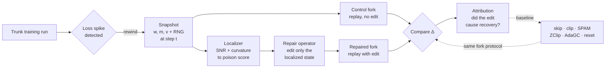
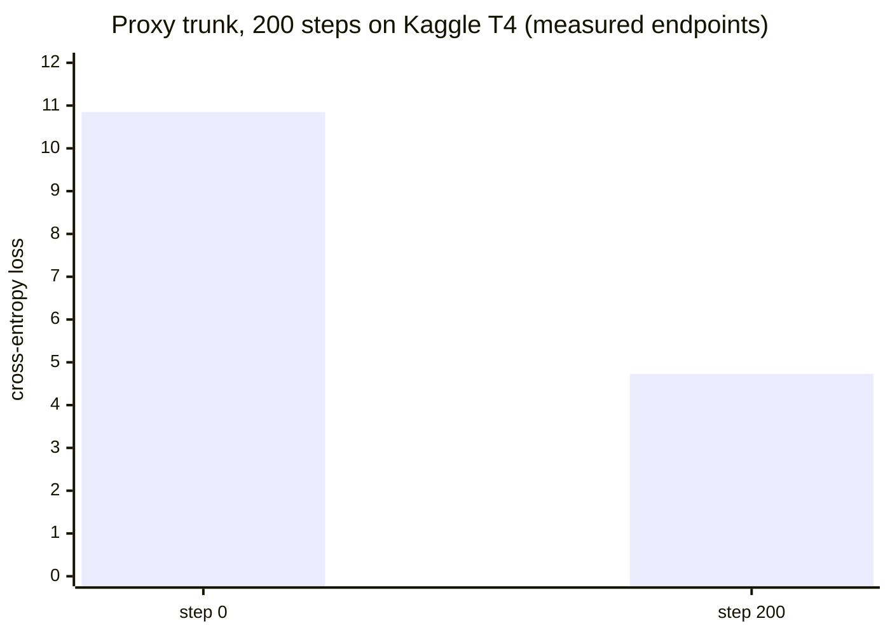

<div align="center">

# Optimizer Autopsy

**Rewind the run. Localize the poison. Repair the state. Prove it.**

Causal localization and repair of optimizer state at the moment a training run's loss spikes — on free compute, with bit-identical replay as the standard of proof.

[](https://github.com/jaztulsi/optimizer-autopsy/actions/workflows/ci.yml)
[](LICENSE)
[](research/requirements.txt)
[-20beff.svg)](#free-stack)
[](#the-determinism-gate)

[Website](https://jaztulsi.github.io/optimizer-autopsy/) ·
[Problem](#the-problem) ·
[Method](#how-it-works) ·
[Determinism gate](#the-determinism-gate) ·
[Results](#results) ·
[Layout](#repository-layout) ·
[Install](#installation) ·
[Quick start](#quick-start) ·
[Status](#status)

</div>

---

Optimizer Autopsy treats a training-loss spike like a crime scene. When a large model's loss suddenly jumps, today's remedies are blunt — clip the gradient, skip the batch, or roll back and hope. None of them answer the question that matters: *which part of the optimizer state actually got poisoned, and would repairing only that part recover the run?* This project answers it, and holds every answer to a hard evidentiary bar: a repaired run must be compared against a **byte-for-byte identical replay**, so the measured recovery is attributable to the repair and nothing else.

## The problem

A spike damages the optimizer's internal state — the Adam moments `(m, v)` and the weights `w` — in ways that persist for thousands of steps. The standard interventions operate globally and blindly. Optimizer Autopsy instead:

1. **Rewinds** training to the exact step the spike began, from a saved snapshot.
2. **Localizes** the damage by scoring every parameter's optimizer state with a signal-to-noise and curvature instrument, producing a *poison score*.
3. **Repairs** only the localized state, then **forks** the run to compare the repaired trajectory against an unedited replay — isolating the causal effect of the edit.

## How it works



Every intervention — ours and each baseline — is applied as a fork off the *same* snapshot, so the only difference between two trajectories is the edit under test.

## The determinism gate

The whole method rests on one property: replaying training from a snapshot must produce identical numbers, or a fork's Δ would be measuring nondeterminism instead of the intervention. This gate is built and verified on both CPU and a real Kaggle T4.


`CUBLAS_WORKSPACE_CONFIG=:4096:8` is exported before torch is imported (the notebook launchers handle this); `research/harness/determinism.py` locks seeds and deterministic algorithms. The guarantee is enforced in CI on every push by `research/tests/test_determinism.py`.

## Results

The proxy trunk (a small nanoGPT) trains on a free Kaggle T4. Its cross-entropy loss more than halved over 200 steps — the training loop learns, and the run is fully reproducible.



Verified facts to date: `bitwise replay OK on cuda: 50 steps, max|Δ| = 0` and `trunk done: 200 steps, loss 10.851 -> 4.730`.

## Repository layout

```
optimizer-autopsy/
├── research/                 All project source (Python)
│   ├── harness/              Determinism, preflight, secrets, (w,m,v) snapshots, trunk + fork runners
│   ├── model/                nanoGPT — proxy (1-3M) and 124M
│   ├── data/                 Reproducible tokenize + shard of the corpus
│   ├── localizer/            The instrument: SNR + curvature to poison score
│   ├── repair/               The surgery: edit the localized optimizer state
│   ├── baselines/            skip · clip · SPAM · ZClip · AdaGC · naive-reset, each as a fork intervention
│   ├── spikes/               Induce spikes, tune the detector, build the K2 spike set
│   ├── analysis/             Eval · stats · attribution · figures
│   ├── theory/               Analytical backing for the localizer
│   ├── experiments/          proxy/ (free MVP) and llm124m/ (robustness) configs + drivers
│   ├── configs/              Shared config loading
│   ├── tests/                Determinism + secret-hygiene gates (run in CI)
│   └── requirements.txt      Pinned to the Kaggle GPU image
├── notebooks/                Kaggle / Colab launchers (set env, clone, load secrets, expose run())
├── index.html                GitHub Pages site (research plan)
├── BUILD_PLAN.md             Full 26-task plan
├── update.md                 Plain-English status
└── .github/workflows/ci.yml  CPU CI gate
```

Large generated artifacts — checkpoints, snapshots, shards, spike sets — stay outside git (see [Free stack](#free-stack)).

## Requirements

- Python 3.11 (matches the Kaggle GPU image)
- A free [Kaggle](https://www.kaggle.com/) account for GPU runs; optional [Colab](https://colab.research.google.com/) for proxy iteration
- Optional: [Hugging Face](https://huggingface.co/) (artifact storage) and [Weights & Biases](https://wandb.ai/) (logging) accounts — both free tier

No local GPU is needed or used; all compute runs on free cloud GPUs.

## Installation

```bash
git clone https://github.com/jaztulsi/optimizer-autopsy.git
cd optimizer-autopsy
pip install -r research/requirements.txt
```

## Quick start

The tests run anywhere (CPU, no secrets, no GPU):

```bash
pytest research/tests/         # determinism gate + secret-hygiene guard
```

Real runs go on a free GPU. Open a notebook launcher — [`notebooks/kaggle_runner.ipynb`](notebooks/kaggle_runner.ipynb) or [`notebooks/colab_runner.ipynb`](notebooks/colab_runner.ipynb) — which sets the determinism env var, clones this repo, loads secrets, and exposes `run(...)`:

```python
run("python -m research.experiments.proxy.smoke")        # free MVP keep/kill signal
run("python -m research.experiments.llm124m.run trunk")  # 124M robustness (budgeted)
```

## Free stack

Everything runs on free tiers — code here, compute in the cloud, artifacts on the Hub.

| Component | Service | Role |
| --- | --- | --- |
| Code | GitHub | This repository |
| Compute | Kaggle T4 (30 h/week, headless via the Kaggle CLI) | Real experiments |
| Compute (iteration) | Colab | Fast proxy-scale iteration |
| Artifacts | Hugging Face Hub (`optimizer-autopsy-artifacts`) | Checkpoints, snapshots, shards, spike sets |
| Logging | Weights & Biases | Loss curves and run metadata |

### Secrets

Secrets are never committed. `research/harness/secrets.py` resolves them at runtime from, in order, the process environment, Kaggle Secrets, Colab userdata, then a gitignored `.env`. A CI test (`test_no_secrets_in_git`) fails the build if any token literal reaches the tracked tree. Required keys: `HF_TOKEN`, `WANDB_API_KEY`.

## Status

Approximately 23 percent built; every component shipped so far is tested and passing.

```
Foundation      ####################  done (4 of 4)
Determinism     ####################  done — perfect replay, GPU-verified
Training engine ############--------  trunk done + GPU-verified; snapshot/fork next
Everything else --------------------  not started
```

| Phase | Scope | State |
| --- | --- | --- |
| 0 · Foundation | scaffold, env check, fixed data, secrets | Complete |
| 1 · Instrument | deterministic replay, proxy model + trunk, snapshot, fork driver | Replay + trunk done; snapshot/fork next |
| 2-6 | spike induction, kill-test, localizer, repair + baselines, attribution, scale + paper | Not started |

Live detail in [`update.md`](update.md); the full 26-task plan is in [`BUILD_PLAN.md`](BUILD_PLAN.md).

## Contributing

Issues and pull requests are welcome. CI runs the determinism and secret-hygiene gates on every push and pull request to `main`; keep both green.

## License

MIT — see [LICENSE](LICENSE).

## Credits

Authored by jaztulsi. See [CONTRIBUTORS.md](CONTRIBUTORS.md). Built with assistance from Claude Code as a development tool.
